#  paragliding-around-the-world
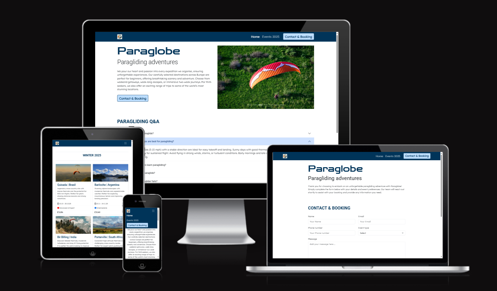

---

[View the Live Project here](https://dagmara-szproch.github.io/paragliding-around-the-world/)

---

# Table of Contents
- [User Experience](#user-experience)
    - [Project Goals](#project-goals)
    - [Business Goals](#business-goals)
    - [User Stories](#user-stories)
    - [Design Choices](#design-choices)
    - [Wireframes](#wireframes)
- [Features](#features)
- [Technologies Used](#technologies-used)
- [Code](#code)
- [Testing](#testing)
    - [Bugs](#bugs)
    - [Unresolved Bugs](#unresolved-bugs)
    - [Tesing User Stories](#testing-user-stories)
    - [Manual Testing](#manual-testing)
    - [Automated Testing](#automated-testing)
    - [Accessibility](#accessibility)
- [Deployment](#deployment)
- [Maintenance & Updates](#maintenance--updates)
- [Credits](#credits)

## User Experience

### Project Goals
**Paraglobe** is a fictitious client — a paragliding company that not only provides training for new enthusiasts but also specialises in organising training sessions and adventure expeditions around the world. As a member, you can learn to paraglide in breathtaking locations with guaranteed favourable weather conditions.

### Business Goals
The primary objective of the website is to **attract more clients** by:
1. Showcasing the company's **training programmes and adventure trips**.
2. Providing **clear and engaging information** about paragliding.
3. Offering a **seamless booking process** for courses and events.
4. Displaying **real customer experiences** through reviews and images.

### User Personas
1. Absolute Beginner
- Someone who has never tried paragliding and wants to learn more about it.
- They need basic information about equipment, safety, and first steps.

2. Beginner Interested in Training
- A user who is already considering starting a course.
- They are looking for detailed course descriptions, prices, and schedules.

3. Experienced Paraglider Looking for Adventures
- Someone who has done basic paragliding locally but is now seeking thrilling new experiences.
- They want exciting international events with stunning scenic views.

### User Stories

1. User Story (must-have):

    As a new customer, I want to quickly understand what paragliding is and see stunning images, so I can decide whether it is something I want to try.

2. User Story (must-have):

    As a First-Time Visitor, I need easy navigation and a user-friendly design, so I can find information quickly without frustration.

3. User Story (must-have):

    As a Potential Customer, I want to see available courses and expeditions, so I can choose the best option for me.

4. User Story (could-have):

    As an experienced paraglider, I want to find events suited to my skill level, so I can fly with peers of a similar experience level.

5. User Story (could-have):

    As  a Potential Customer, I want to see real customer reviews and photos, so I can better understand the experience.

6. User Story (should-have):

    As a Regular Customer, I want to sign up for a newsletter and updates, so I can be informed about new offers and events.

7. User Story (must-have):

    As a customer, I want to easily reserve my place on a trip or event and request more information about it.

[View Full User Stories, including acceptance criteria and tasks](docs/user-stories.md)

The project's Kanban Board can be viewed [here](https://github.com/users/dagmara-szproch/projects/1)

### Design Choices

**Colour Scheme**

The colour scheme was carefully selected using a [Contrast Checker](https://webaim.org/resources/contrastchecker/) to ensure accessibility and readability.
- #003459 Prussian blue was chosen as the primary colour, as it evokes a sense of depth and stability while complementing sky-themed imagery. After browsing gradients,
- #BDDEFF French Pass was selected for its excellent contrast ratio, creating a harmonious and visually appealing design that enhances both text and images.

    
 
    
Click here to see the Colour Palette

    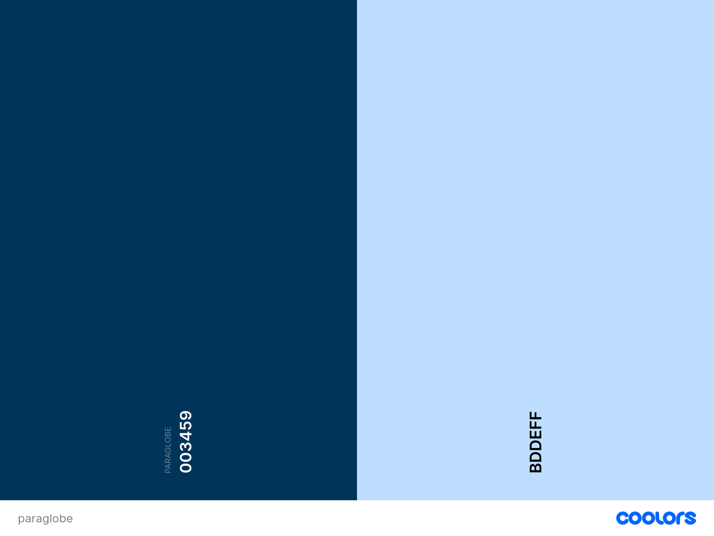
    

**Fonts**

[Google Fonts](https://fonts.google.com/) was used to select the typography for the website, ensuring readability and visual appeal. 
- Zen Dots was chosen for H1 headings, giving a modern and dynamic look.
- Lexend, a sans-serif font with a strong readability rating, is used for body text to enhance the user experience. 
- Roboto was selected for H2 and H3 headings, providing a clean and professional appearance while maintaining consistency across the design.

**Icons**

[Font Awesome](https://fontawesome.com/) was used to select icons that visually reinforce their associated meanings. Each icon was carefully chosen to enhance user understanding and navigation. For example, a *map pin* icon was used for the address, as it is commonly associated with locations on maps. A *calendar icon* was selected to represent event dates, making it immediately clear and recognisable. These icons contribute to a more intuitive and user-friendly design.

**Images/Videos**

Images were carefully selected from [Pixabay](https://pixabay.com/) and [Pexels](https://www.pexels.com/) ensuring they were free to use and relevant to the theme. The chosen images showcase paragliders in action — some soaring through the sky, while others are preparing for takeoff. For event cards, breathtaking landscape images were selected to highlight the stunning locations participants can experience on our expeditions. Additionally, a video file featuring the view of paragliders taking off was included to enhance the immersive experience.

### Wireframes

Wireframes were created for mobile, tablet and desktop using Balsamiq.

- **Home Page wireframe** 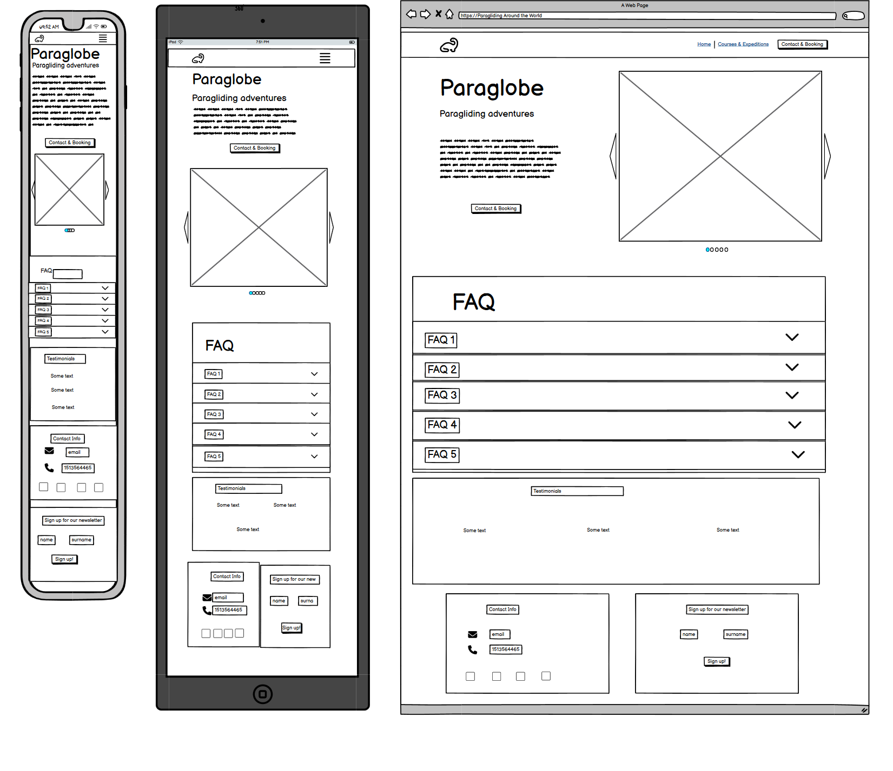

- **Events Page wireframe** 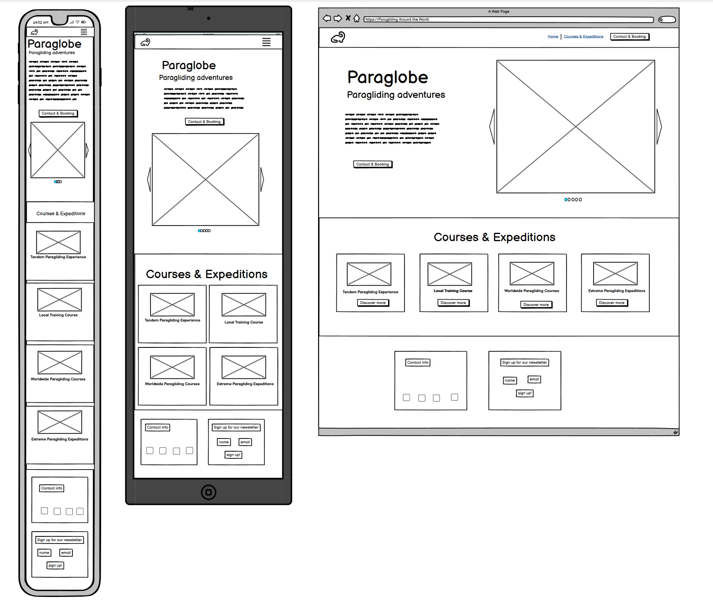

- **Contact Page wireframe** 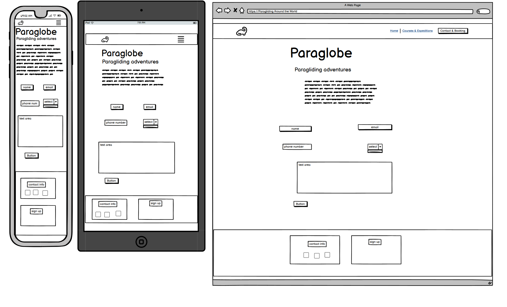

---

## Features

The website consists of four pages, three of which are accessible from the navigation bar. All pages share the same navbar and footer.

- The navbar includes a logo positioned on the left, which also serves as a link to the homepage. On the right side, there is a menu with links to Home and Events 2025, as well as a button-link leading to the Contact & Booking page. This button is visually distinct from the other navigation items with a different colour. The navbar expands on large devices, while on smaller screens, it appears as a burger menu icon. The navbar is also fixed to the top of the page.

- The footer contains basic contact information, including the address and email address. On the right side, there are four social media links, while on the left, there is a sign-up form for the newsletter.

- Home Page

    The homepage features a header with a call-to-action (CTA) text, encouraging users to join an expedition, along with a CTA button linking to the booking page. Within the same container, on the right side, there is a Bootstrap carousel displaying images. Below the header, there is an FAQ section, implemented using the Bootstrap accordion.

- Events Page

    This page also includes a header beneath the navbar, similar in layout to the homepage. It contains CTA text encouraging participation (with different content than on the homepage) and a CTA button linking to the Contact & Booking page. On the right side, there is a muted, autoplaying video, with buttons allowing users to control navigation.

    Below the header, there is a section showcasing upcoming trips, using Bootstrap cards. Each card consists of: An image / The destination name / A short description / The date / The difficulty level / The price
    Below the event cards, there is a button leading to the Contact & Booking page.

- Contact Page

    This page contains a Bootstrap form with the following required fields:
    Name, Email (must include @ symbol), Phone number (only numerical values allowed), Dropdown menu with selectable trip options (eight trips to choose from) , Text box.
    Below the form, there is a button-link leading to the final page, which is not accessible from the navbar.

- Confirmation / Thank You Page

    The final page displays a thank-you note and confirmation that the request has been received. Below the message, there is a button to return to the homepage.

---

## Technologies Used

- HTML and CSS were used as the languages.
- [Balsamiq](https://balsamiq.com/) to create wireframes.
- [Bootstrap 5.3.x](https://getbootstrap.com/) was used throughout the project to style and structure various elements, including the navbar, containers, carousel, buttons, link buttons, accordion, forms, and cards.
- [Font Awesome](https://fontawesome.com/) to incorporate icons.
- [Google Fonts](https://fonts.google.com/) to import fonts.
- [Birme](https://www.birme.net/) to resize, crop, compress and change the image format to WEBP.
- [Tiny PGN](https://tinypng.com/) to compress the images.
- [Freeconvert](https://www.freeconvert.com/video-compressor) video compressor.
- [Contrast Checker](https://webaim.org/resources/contrastchecker/) to check the contrast between colours.
- [Pixabay](https://pixabay.com/) to downland the images for the carousel and cards.
- [Pexels](https://www.pexels.com/) to downland a video file and images.
- [Favicon](https://favicon.io/) to create favicon.
- [Open AI](https://openai.com/chatgpt/overview/) to create logo.
- [CSS Validator](https://jigsaw.w3.org/css-validator/) to test style.css
- [HTML Validator](https://validator.w3.org/) Markup Validation Service
- Lighthouse Chrome Dev Tools for testing.
- [GitHub](https://github.com/) to store my project, project board.

---

## Code

- Bootstrap 5.3.x was used throughout the project to style and structure various elements, including the navbar, containers, carousel, buttons, link buttons, accordion, forms, and cards.
- Code Institute tutorials: contact form from Boardwalk Games project.

---

## Testing

### Bugs
 1. [validator W3](https://validator.w3.org/) - I used this tool regularly after an issue arose when using a Prettier extension in VS Code. It altered my code unexpectedly, adding trailing slashes on void elements, which had no effect and interfered with unquoted attribute values. From that point on, I made it a habit to check my code frequently.

2. The second bug I discovered was also through W3C validation. It turned out that I had used the same id="name" and id="email" for both the contact form and the newsletter signup form. This issue only became visible on the contact page because both forms appeared there. To resolve it, I changed the id and name attributes in the contact form to name-contact and email-contact. This fixed the issue.

3. A common problem I encountered was unexpected changes on the page—elements disappearing or moving unexpectedly. These were usually caused by accidental edits when my cursor was in the wrong place. I learned to use Ctrl + Z to undo and Ctrl + Y to redo changes, which helped resolve such issues efficiently.

4. Another problem I encountered was with accessibility. When I ran Lighthouse in Chrome DevTools, it showed an accessibility score of 95%. The issue was related to poor contrast between text and background colours. To fix this, I adjusted the colours to improve readability.

5. Lighthouse also flagged another accessibility issue: my buttons were too small. The recommended minimum size is 24px, and I wasn’t fully satisfied with the buttons in the navbar. Taking this into account, I set the nav-items and all buttons to 1.25rem. While they might appear large to some, I believe they are now more accessible, particularly for users with vision impairments.

6. There were also smaller problems, such as sizing issues, which I resolved through trial and error. All responsiveness-related issues were addressed by following the Code Institute tutorials.

### Unresolved Bugs
1. One unresolved issue remains with the newsletter signup form. I wanted to use Bootstrap’s modal to confirm the signup, but when I implemented it, the name and email fields were no longer required. I tried changing the button’s type="submit", but this did not work. For now, I have linked the submit button to the existing success/thank-you page, which was originally intended for the contact & booking form. A potential quick fix could be creating a separate thank-you page without the navbar and footer, containing only a link back to the homepage and a confirmation message.

### Testing User Stories

- _As a **New Customer**, I want to quickly understand what paragliding is and see stunning images, so I can decide whether it is something I want to try._

Hero section with engaging images using carousel:

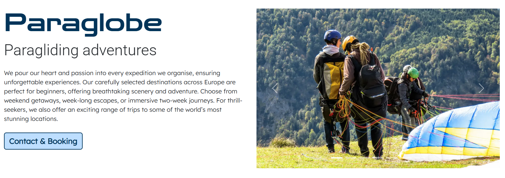

FAQ section answering beginner question:

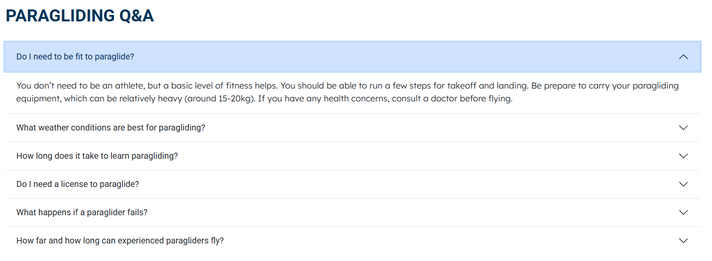

- _As a **First-Time Visitor**, I need easy navigation and a user-friendly design, so I can find information quickly without frustration._

Fixed navigation bar:

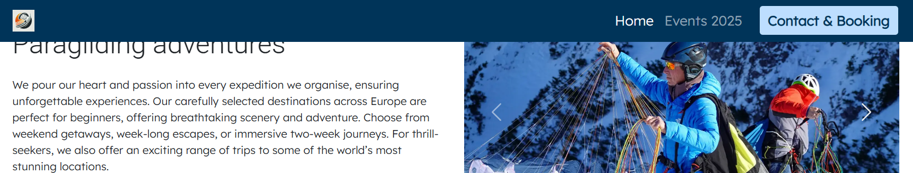

Mobile and tablet responsiveness:

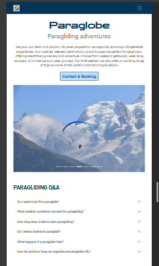

- _As a **Potential Customer**, I want to see available courses and expeditions, so I can choose the best option for me._

A list of upcoming events:

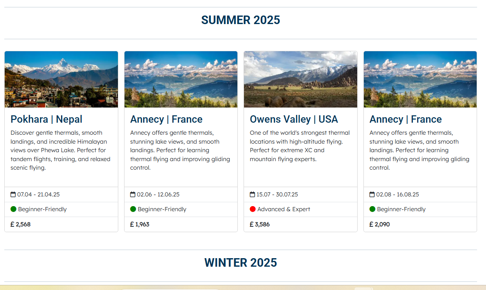

- _As an **Experienced Paraglider**, I want to find events suited to my skill level, so I can fly with peers of a similar experience level._

Events clearly marked as beginner, intermediate or advanced:

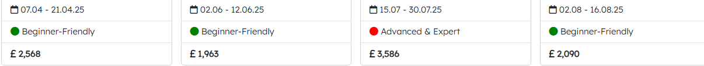

- _As a **Regular Customer**, I want to sign up for a newsletter and updates, so I can be informed about new offers and events._

A subscription form for newsletter:

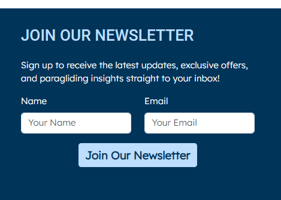

- _As a **Customer**, I want to easily reserve my place on a trip or event and request more information about it._

Contact page with the text area:

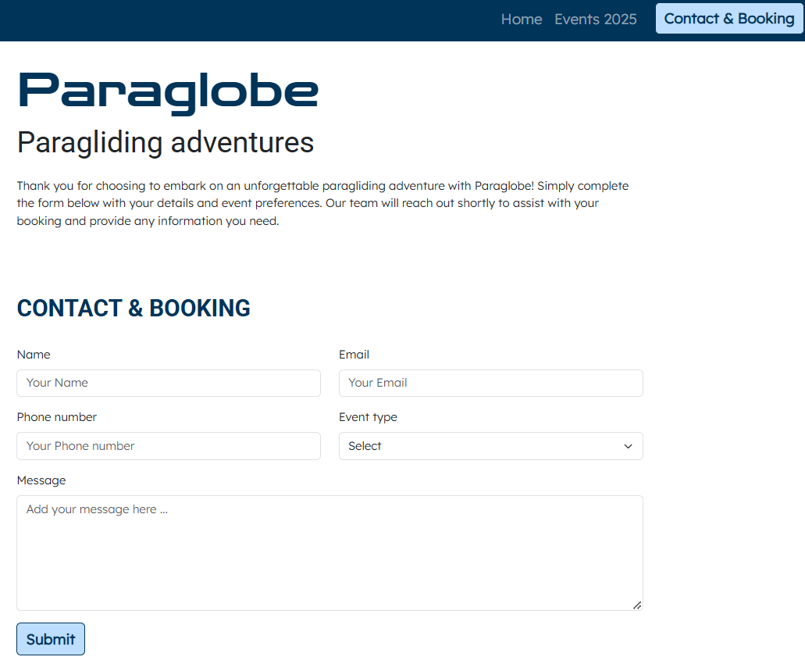

Confirmation page:

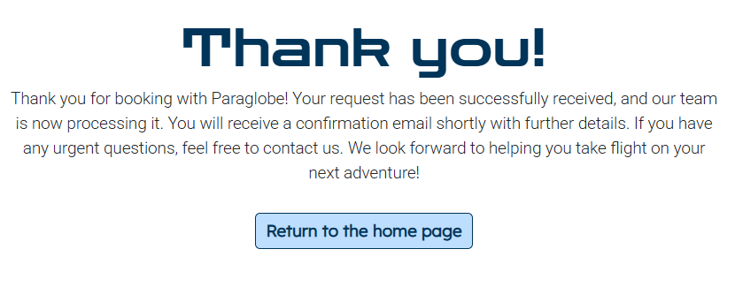

### Manual Testing

Manual testing was performed on two different browsers—Chrome and Microsoft Edge — on both a laptop with a large screen and a mobile phone (Android) using Chrome.

1. On every page, I clicked all possible links to ensure they behaved as expected. All 3 external links correctly opened in a separate window.

I also tested the Contact & Booking form:

2. I attempted to submit the form without entering any data, and it correctly prompted me to fill in the first required field (Name).
I tested each required field individually by leaving one empty at a time, and the form consistently displayed the appropriate validation message.
The Select options worked as expected, preventing submission if "Select an option" was chosen. Users were required to select an event/trip to proceed.

3. The Newsletter Signup form revealed some issues. Initially, both fields worked as expected, preventing submission without filling them in. 
However, after adding a modal confirmation button, the required fields no longer worked properly — the modal appeared without any validation. 
To resolve this temporarily, I linked the signup form to the existing success/thank-you page, which now functions correctly.

4. Other tested elements:

- The logo, which links to the homepage, was checked and worked as expected, redirecting correctly every time.
- The Success/Thank You page was also tested, including the "Return to Home" button, which functioned properly.

### Automated Testing

[validator W3](https://validator.w3.org/) was used to validate the HTML on all pages, and [jigsaw.w3](https://jigsaw.w3.org/css-validator/) for style.css and the code passed with no errors or warnings to show.
- index.html page 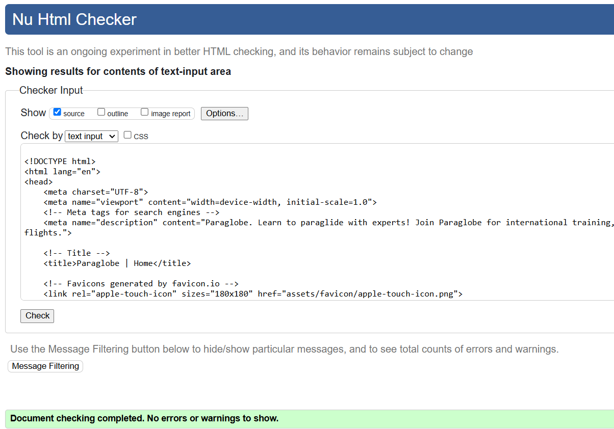
- events.html page 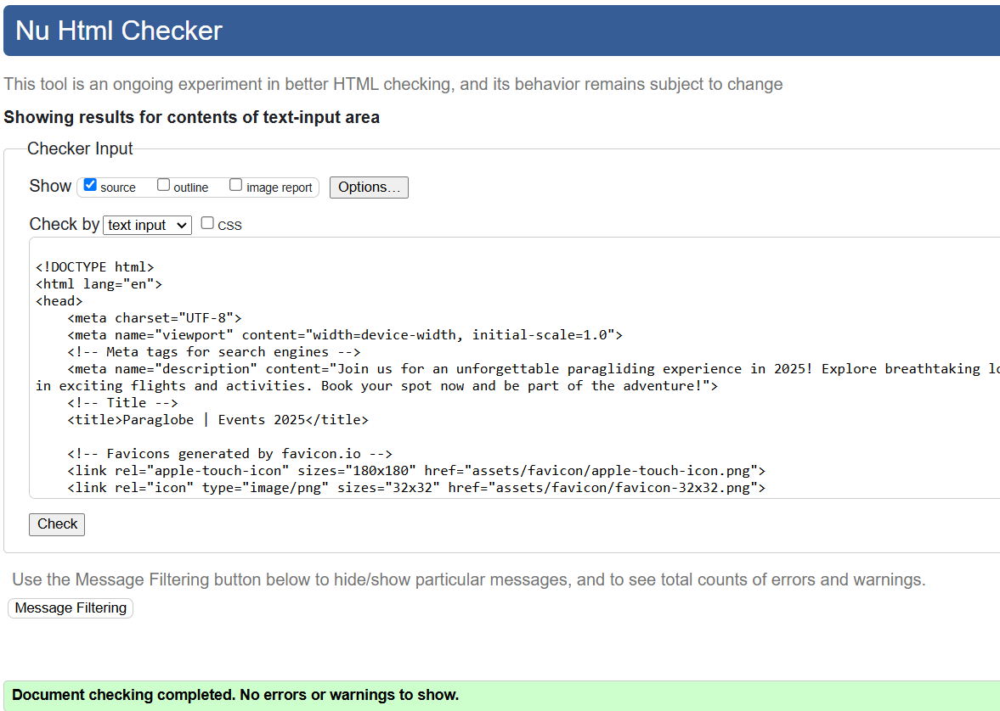
- contact.html page 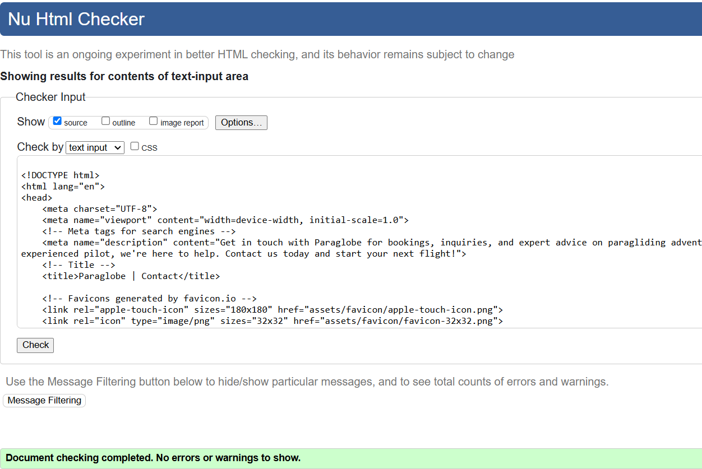
- success.html page 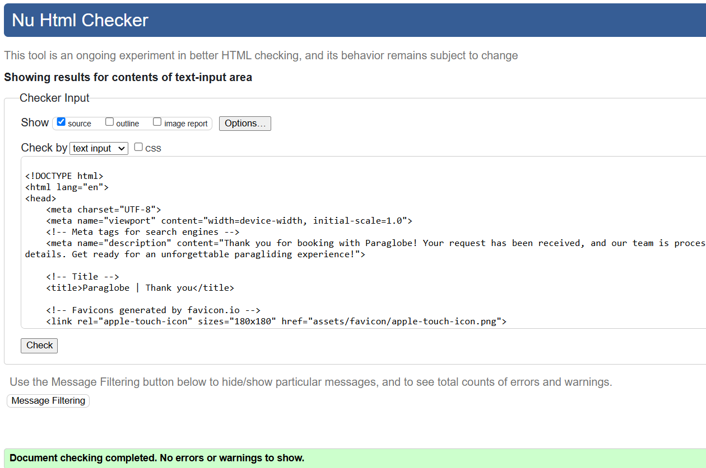
- style.css page 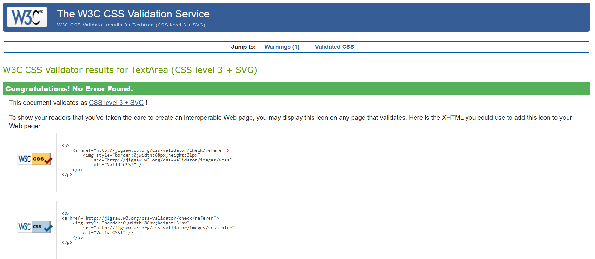

The final Lighthouse (Chrome Dev Tools) testing to check the performance, accessibility, best practices and SEO.
- mobile home page
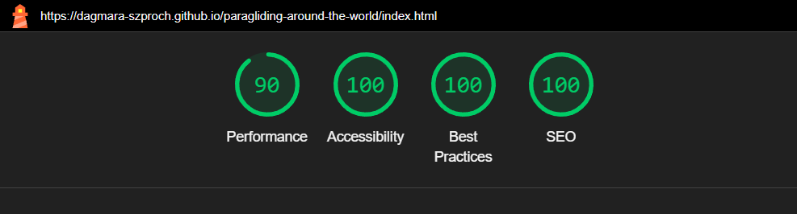
- desktop home page
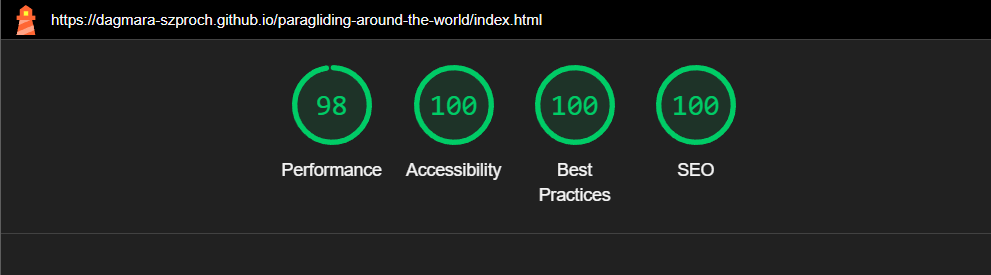
- mobile events page
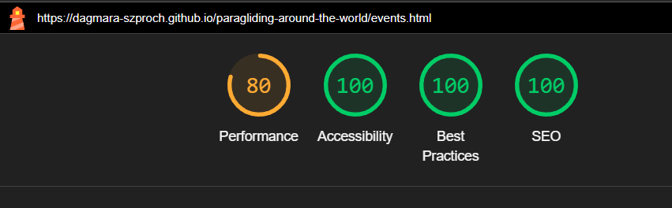
- desktop events page
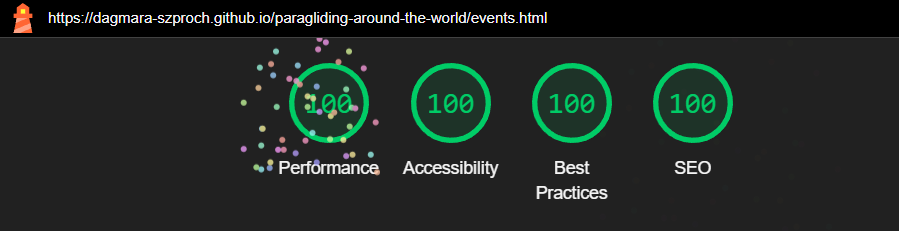
- mobile contact page
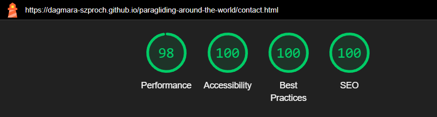
- desktop contact page
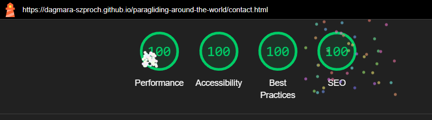
- mobile success page
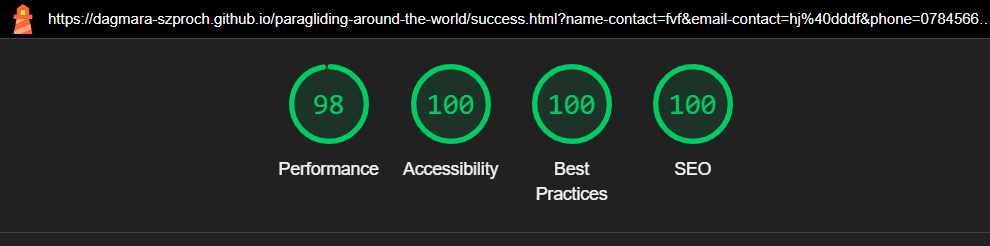
- desktop success page
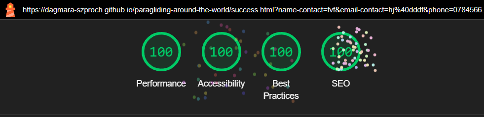

[validator.w3](https://validator.w3.org/) was used to ensure there are no broken internal links
- 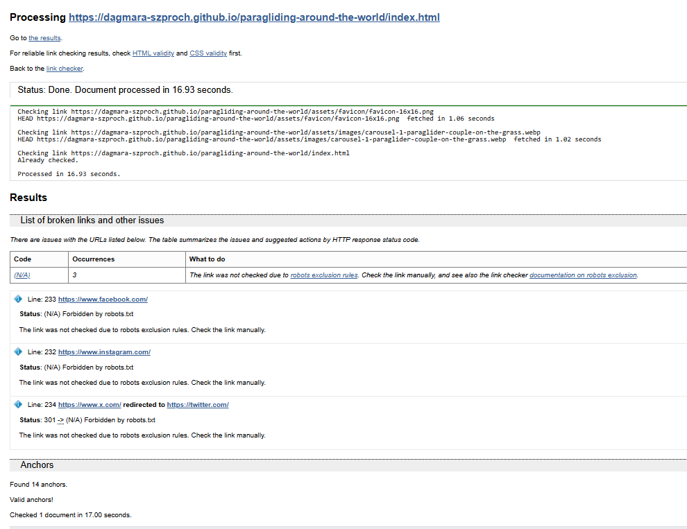

### Accessibility

1. I used meaningful alt text for images.
2. I implemented semantic HTML elements such as header, main, and section for better structure and navigation.
3. I ensured that all clickable elements are proper button elements instead of div or span.
4. I used labels for all form inputs to improve usability for screen readers.
5. I maintained sufficient contrast between the background and content for readability.
6. The video is keyboard-accessible, allowing users to control playback using only a keyboard.

---

## Deployment

The website was deployed using GitHub Pages, which provides a simple way to host static websites directly from a GitHub repository. Below are the steps taken to deploy the project:

1. Repository Setup
- The project files were uploaded to a GitHub repository.
- The main branch was used for deployment.

2. Enabling GitHub Pages
- In the repository settings, GitHub Pages was enabled.
- The source branch was set to main.
- The deployment was configured to serve files from the root directory.
3. Accessing the Live Website
- Once the deployment process was completed, the website became accessible at the provided GitHub Pages URL.
- The link to the deployed site: https://dagmara-szproch.github.io/paragliding-around-the-world/

4. Updating the Website
- Any changes pushed to the main branch automatically update the live website.
- Regular updates are made using Git commits and pushes.

--

## Maintenance & Updates
Ongoing maintenance and updates are essential to ensure the website remains functional, informative, and user-friendly. Below are planned improvements and updates for the project:

1. Enhanced Trip Descriptions
- Add detailed itineraries for each trip, outlining daily activities (e.g., Day 1: Arrival & briefing, Day 2: Training sessions, Day 3: Adventure flight, etc.).
- Provide more details about included services such as accommodation, meals, and transport.

2. Accommodation & Travel Information
- Add descriptions of accommodation options, including photos and amenities.
- Provide guidance on travel arrangements, nearest airports, and transport to the paragliding site.

3. Improved Newsletter Sign-up Process
- Enhance the newsletter form to allow users to select their interests (e.g., Beginner training, Adventure trips, Special offers).
- Fix the issue where required fields are bypassed when using Bootstrap modals.
- Possibly integrate an email confirmation step for better user engagement.

4. Trip Updates & Seasonal Offers
- Regularly update the trips section with new destinations and availability.
- Add a section for limited-time offers, last-minute deals, or early-bird discounts.

5. Performance & Accessibility Improvements
- Optimise images and videos for faster loading times.
- Ensure all new content meets accessibility standards (e.g., alt text, keyboard navigation).

## Credits

### Content
- https://openai.com/chatgpt/overview/ The content was written by me but was reviewed for spelling, grammar and consistency, and enhanced with the help of ChatGPT. Some sections were also translated and refined to improve readability. I also asked ChatGPT for FAQs about paragliding, and it provided the answers. Additionally, ChatGPT helped by providing information on the best places to paraglide and the reasons why they are ideal.

### Media

1. Images

    Images for the carousel
- https://www.pexels.com/photo/two-people-paragliding-together-12575878/
- https://www.pexels.com/photo/winter-paragliding-adventure-in-the-alps-29989277/
- https://pixabay.com/photos/paragliding-paraglider-4493110/
- https://pixabay.com/photos/paraglider-nostalgia-flying-1306371/
- https://www.pexels.com/photo/person-paragliding-above-the-fields-15737001/
- https://www.pexels.com/photo/parachuters-on-the-grass-field-13623041/
- https://pixabay.com/photos/paramotor-flight-paragliding-flying-5335016/

    Images for the events cards
- https://www.pexels.com/photo/people-paragliding-in-mountain-valley-6149892/
- https://www.pexels.com/photo/people-using-parachute-5322131/
- https://pixabay.com/photos/mountain-semnoz-annecy-landscape-4692933/
- https://pixabay.com/photos/bariloche-argentina-patagonia-lake-7286017/
- https://pixabay.com/photos/owens-valley-california-sierra-4945130/
- https://pixabay.com/photos/fishtail-mountain-pokhara-city-5009522/
- https://pixabay.com/photos/landscape-nature-mountains-heaven-4932848/

2. Video
- https://www.pexels.com/video/paragliders-flying-in-a-mountain-landscape-with-low-clouds-13240703/

3. Logo
- Logo image generated using DALL·E, an AI image-generation tool by OpenAI.

### Design
The design of this website was inspired by the Boardwalk Games tutorial from Code Institute. Some layout and styling solutions were adapted from the tutorial to fit the needs of this project.
Bootstrap navbar, a header with a Bootstrap carousel (I used a different one, but the concept of two columns on large devices and up was taken from the tutorial). The events page layout with cards and their styling was also inspired by the tutorial. The contact page, including the form code, was fully incorporated from the tutorial as it suited the project's needs.

---

